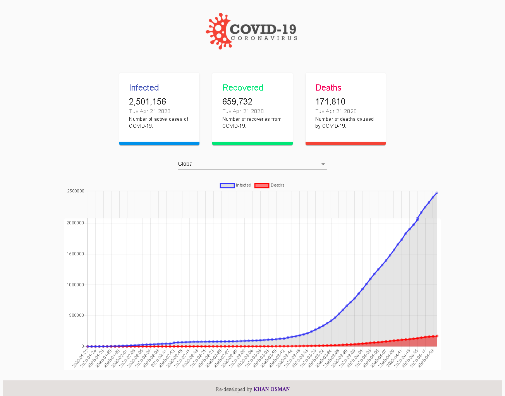

# App Name : Corona_Data_vs
# Version:1.0.0
# Author: Khan Osman
# Originality: Re-developed
# Thanks to @adrianhajdin for this amazing project.

# Covered topics: React.js, Chart.js, Material UI 
# This is a visualiser app where users can get the latest graphical data of COVID-19.  

Screen Shot:

